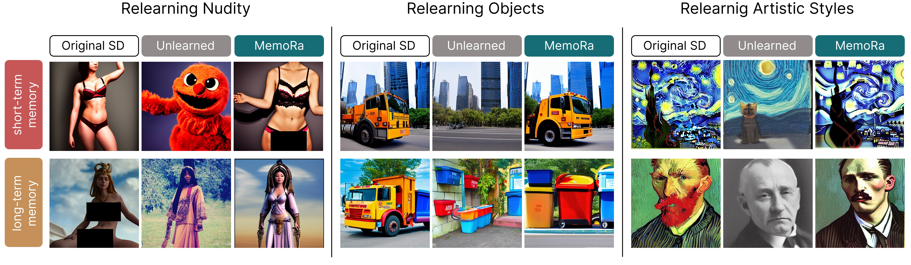

# Memory Self-Regeneration: Uncovering Hidden Knowledge in Unlearned Models
Agnieszka Polowczyk, Alicja Polowczyk, Joanna Waczyńska, Piotr Borycki, Przemysław Spurek (*equal contribution)


**Abstract:** The impressive capability of modern text-to-image models to generate realistic visuals has come with a serious drawback: they can be misused to create harmful, deceptive or unlawful content. This has accelerated the push for machine unlearning. This new field seeks to selectively remove specific knowledge from a model's training data without causing a drop in its overall performance. However, it turns out that actually forgetting a given concept is an extremely difficult task. Models exposed to attacks using adversarial prompts show the ability to generate so-called unlearned concepts, which can be not only harmful but also illegal. In this paper, we present considerations regarding the ability of models to forget and recall knowledge, introducing the Memory Self-Regeneration task. Furthermore, we present MemoRa strategy, which we consider to be a regenerative approach supporting the effective recovery of previously lost knowledge. Moreover, we propose that robustness in knowledge retrieval is a crucial yet underexplored evaluation measure for developing more robust and effective unlearning techniques. Finally, we demonstrate that forgetting occurs in two distinct ways: short-term, where concepts can be quickly recalled, and long-term, where recovery is more challenging. 

## 1. Environment Setup

### 1.1 Clone this repository (with submodule)
```bash
git clone --recursive https://github.com/gmum/MemoRa.git
cd MemoRa
```

### 1.2 Create and activate Conda environment
```bash
conda create -n memora python=3.13
conda activate memora
```

### 1.3 Install HuggingFace Diffusers
```bash
cd diffusers
pip install .
cd examples/text_to_image
pip install -r requirements.txt
```

### 1.4 Install PyTorch with CUDA 11.8
```bash
pip install torch==2.7.1 torchvision==0.22.1 torchaudio==2.7.1 --index-url https://download.pytorch.org/whl/cu118
```


### 1.5 Install project requirements
```bash
cd MemoRa
pip install -r requirements.txt
```


## 2. Download Checkpoints
### 2.1 Install gdown
```bash
pip install gdown
```

### 2.2 Download model checkpoints (https://github.com/OPTML-Group/AdvUnlearn)
```bash
# AdvUnlearn ckpts
gdown --folder https://drive.google.com/drive/folders/1toiNWxJEX0X8pm8b88Og5_nMAqq6NZRd

# [Baseline ckpts] Nudity
gdown https://drive.google.com/uc?id=1wOqACzdpWpjRjl-a3hWgtjGAhemnelQr

# [Baseline ckpts] Style
gdown https://drive.google.com/uc?id=1-Gyl7Ls-Pa4vJzReG58bXjfI_YWu8teb

# [Baseline ckpts] Objects
gdown https://drive.google.com/uc?id=1OjYiFxYwd1B9R7vfKG6mooY27O2txYNg

```

## 3. MemoRa
If you want to run experiments for objects or styles, simply change the config name. 

**Important:** use the correct prefix (`model_nudity@`, `model_parachute@`, etc.)

### 3.1 Inversion
```bash 
python inversion_images.py \
   model_nudity@unlearned=<MODEL> \
   model_nudity@original=sd \
   interpolation
   start_step=15 \
   --config-name=reunlearning_nudity
```

### 3.2 LoRa training
```bash 
python train_lora.py \
   model_nudity@unlearned=<MODEL> \
   model_nudity@original=sd \
   interpolation.start_step=15 \
   lora.steps=500 \
   --config-name=reunlearning_nudity
```  

### 3.3 Generate images
Baseline: Original Stable Diffusion
```bash
python generate_images.py \
   model_nudity@unlearned=<MODEL> \
   model_nudity@original=sd \
   model_nudity@evaluation=sd \
   interpolation.start_step=15 \
   generate_images.start_index=0 \
   generate_images.n_images=200 \
   generate_images.csv_file="nudity.csv" \
   --config-name=reunlearning_nudity
```  
Unlearned model + MemoRa
```bash
python generate_images.py \
   model_nudity@unlearned=<MODEL> \
   model_nudity@original=sd \
   model_nudity@evaluation=<MODEL> \
   interpolation.start_step=15 \
   generate_images.start_index=0 \
   generate_images.n_images=200 \
   generate_images.csv_file="nudity.csv" \
   --config-name=reunlearning_nudity
```

Unlearned model without MemoRa
```bash
python generate_images.py \
   model_nudity@unlearned=<MODEL> \
   model_nudity@original=sd \
   model_nudity@evaluation=<MODEL> \
   generate_images.lora_scale=null \
   generate_images.lora_weights=null \
   interpolation.start_step=15 \
   generate_images.start_index=0 \
   generate_images.n_images=200 \
   generate_images.csv_file="nudity.csv" \
   --config-name=reunlearning_nudity
```

## 4. Evaluation with FID & CLIP
### 4.1 Install extra packages:
```bash
pip install git+https://github.com/openai/CLIP.git
pip install git+https://github.com/boomb0om/text2image-benchmark
```
### 4.2 Running FID & CLIP

```bash
python evaluate_fid.py \
   model_nudity@unlearned=<MODEL> \
   model_nudity@original=sd \
   model_nudity@evaluation=<MODEL> \
   interpolation.start_step=15 \
   generate_images.csv_file="coco_10k.csv" \
   --config-name=reunlearning_nudity
```
```bash
python evaluate_clip.py \
   model_nudity@unlearned=<MODEL> \
   model_nudity@original=sd \
   model_nudity@evaluation=<MODEL> \
   interpolation.start_step=15 \
   generate_images.csv_file="coco_10k.csv" \
   --config-name=reunlearning_nudity
```


